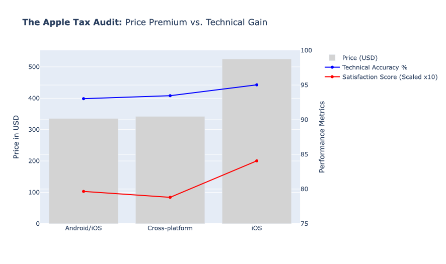

# Strategic Audit: Wearable Tech Market 2025
**Bridging Market Opportunity (Tableau) with Technical Due Diligence (Python)**

## 📌 Executive Summary
This project evaluates the Q2 2025 wearable market. By combining Tableau’s market mapping with Python’s algorithmic auditing, I identified that while **Smart Rings** are the strongest growth opportunity, **Smartwatches** remain the only viable choice for clinical-grade reliability due to a significant "Trust Gap."

---

## 📊 Phase 1: Market Vision (Tableau)
I utilized Tableau to identify "White Spaces" and prioritize our product roadmap. 

**Key Insights:**
* **The Gold Mine:** Smart Rings show high consumer satisfaction and market expansion potential.
* **The Trap:** Sports Watches show high battery life but marginal accuracy gains, leading to a "Value Trap" for premium users.

---

## 🐍 Phase 2: Technical Due Diligence (Python)
To mitigate investment risk, I performed a technical audit to stress-test the hardware claims.

### 1. The Clinical Trust Index
I engineered a custom index weighting **Heart Rate Accuracy (70%)** against **User Satisfaction (30%)**.

**Audit Finding:** High price correlates with clinical trust. Smart Rings, despite their high cost, still sit in a lower "Trust Cluster" compared to established Smartwatches.

### 2. The Ecosystem Tax (Apple Tax)
I investigated if the price premium for iOS-exclusive devices is backed by technical superiority.

**Audit Finding:** iOS users pay a **53% price premium** for a marginal **1.5% gain** in accuracy. The high satisfaction is driven by ecosystem "Halo Effects" rather than technical lead.

---

## 💡 Strategic Recommendations
1. **Procurement:** Favor Cross-platform Sports Watches for the best Price-to-Accuracy ROI.
2. **Product Roadmap:** Invest in Smart Ring R&D but wait for sensor variance to stabilize before clinical deployment.
3. **Marketing:** Focus on "Data Stability" as a premium feature for high-precision segments.
